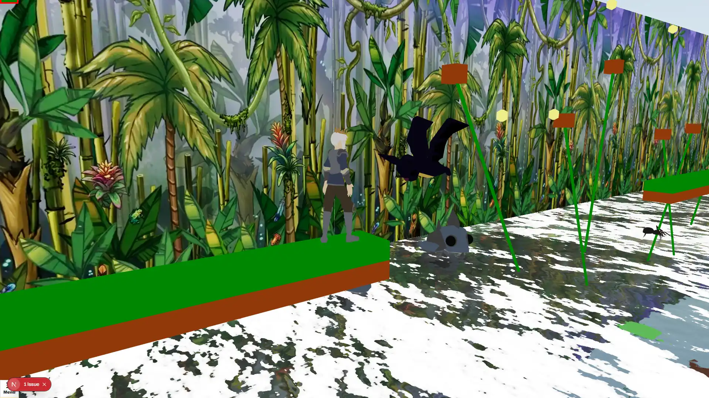

# Jungle Vines

Swing vine to vine and complete the course in classic mode or see how far you can get in the endless mode.



## Getting Started

First you will need to setup a .env file from the .env.sample provided.

Then development server can be run:

```bash
npm run dev
```

## Controls

✅ Keyboard
⚠️ Touch
⚠️ Gamepad (Xbox One Controller)

## Multiplayer

Play along side friends for now over WebSockets via Socket.IO. Planning to have race mode working one day.

## TODO

...

## Scripts

In the scripts folder is reset_public and sync_to_s3. This is only for Articles Media usage. Allows for putting public folder to CloudFront to lower Vercel charges for the public facing site.

## Inspiration

This game is inspired by the Toontown Online Trolley Game: [Jungle Vines](https://toontown.fandom.com/wiki/Jungle_Vines)!

## Attributions

[Spider Model](https://poly.pizza/m/yRYJiAJyiM)  
[Fly Model](https://poly.pizza/m/f8kM9xA_5sV)  
[Bat Model](https://poly.pizza/m/hNO9XvjlKa)  
[Crocodile Model](https://poly.pizza/m/fnUp2MrGjmr)  
[Player Models - Quaternius](https://quaternius.com/packs/ultimatemodularcharacters.html)